<picture>
  <source media="(prefers-color-scheme: dark)" srcset="assets/header-dark.svg">
  
</picture>

  
  

I am a backend developer at DoiT Link LLC, working in C# and ASP.NET Core. Over the past year I have built the server side of three company products and one freelance platform: the Web APIs, the data models on SQL Server and PostgreSQL, authentication, billing, background jobs, and third-party integrations.

## What I build

This work lives in private repositories, so the code is not on this profile. Below are the products and the backend parts I built.

### RepriceMax

*Multi-tenant Amazon repricing SaaS · DoiT Link LLC · Sep 2025 to present*

`.NET 9` `ASP.NET Core` `EF Core` `SQL Server` `Stripe`

- **Billing:** Stripe subscriptions with checkout, webhook handling, trials, promo codes, and plan-limit enforcement.
- **Workflow engine:** a hosted background job that runs team-defined repricing rules on a schedule and logs every run.
- **Integrations:** REST connectors for the SellerCloud and SureDone inventory systems, with syncs that restore the original data on disconnect.
- **Platform:** migrated the app from Razor MVC to a pure Web API and added admin APIs for logs and job monitoring.

### aqar.eg

*Real-estate marketplace for Egypt · DoiT Link LLC · Jul 2026 to present*

`.NET 10` `EF Core` `PostgreSQL` `PostGIS` `xUnit` `Docker`

- **API:** built the backend from the first commit in Clean Architecture, with 26 controllers and more than 200 REST endpoints.
- **Search:** PostGIS proximity and bounding-box queries, plus keyword matching in Arabic and Franco-Arabic.
- **Access:** JWT authentication with phone OTP, Google sign-in, 2FA, and custom roles and permissions.
- **Trust:** KYC identity checks, perceptual-hash detection of duplicate photos, and background sweeps that expire stale listings.
- **Quality:** xUnit unit tests and architecture tests in GitHub Actions; the API ships as a Docker image with health probes.

### Veerly

*Driving-test preparation app · DoiT Link LLC · Apr to Jul 2026*

`.NET 10` `EF Core` `SQL Server` `Azure AI Speech` `AWS S3`

- **Text to speech:** a pipeline on Azure AI Speech that caches generated audio in AWS S3 and keeps a usage ledger for cost tracking.
- **Purchases:** server-side validation of Apple and Google in-app purchase receipts before a subscription is granted.
- **Performance:** cut translation reloads from the database by about 99% by extending the cache lifetime from 5 minutes to 24 hours.

### NonArabs API

*Online Arabic-lessons platform · freelance, team of two · Dec 2025 to present*

`.NET 8` `EF Core` `SQL Server` `SignalR` `Docker` `Nginx`

- **API:** main backend developer on a Clean Architecture Web API with 43 controllers and about 300 endpoints for booking, lesson scheduling, and credit-based billing.
- **Real time and jobs:** chat over SignalR, and nine background services for reminders, recurring lessons, and booking expiry.
- **Security:** JWT, BCrypt, rate limiting, and security-header and exception middleware.
- **Quality:** more than 100 xUnit tests, including architecture tests that run in CI; deployed with Docker Compose behind Nginx.

## How I build APIs

<picture>
  <source media="(prefers-color-scheme: dark)" srcset="assets/pipeline-dark.svg">
  
</picture>

- **Layers with rules:** Clean Architecture, where the domain depends on nothing and architecture tests fail the build if a layer reaches where it should not.
- **Thin controllers:** a controller resolves the caller and maps the result to a status code; the business rules live in application services.
- **Tested and shipped:** xUnit unit and integration tests, Docker images with health checks, and GitHub Actions for CI.

## Stack

| Area | Tools |
|---|---|
| **Languages** | `C#` `SQL` `TypeScript` |
| **Backend** | `ASP.NET Core Web API` `EF Core` `LINQ` `SignalR` `FluentValidation` `Serilog` |
| **Data** | `SQL Server` `PostgreSQL` `PostGIS` |
| **Security** | `JWT` `RBAC` `OTP / 2FA` `Google sign-in` `Rate limiting` |
| **Testing and delivery** | `xUnit` `NetArchTest` `Docker` `GitHub Actions` `Nginx` |
| **Integrations** | `Stripe` `AWS S3` `Azure AI Speech` `Firebase Cloud Messaging` `Web Push` |

## Public repositories

These are learning projects from before my first job.

- [E-commerce-Practice-project](https://github.com/AhmedAtefHegazy/E-commerce-Practice-project): ASP.NET Core MVC with N-tier architecture, Repository and Unit of Work, and ASP.NET Core Identity
- [DVLD-WinForm](https://github.com/AhmedAtefHegazy/DVLD-WinForm): driving-licence management system in C# with a 3-tier architecture and SQL Server
- [flutter-app-back-end](https://github.com/AhmedAtefHegazy/flutter-app-back-end): ASP.NET Core Web API backend for a mobile app

## Training

More than 24 course certificates, most of them from the Programming Advices roadmap: C# (Levels 1 and 2), OOP, SQL and T-SQL, data structures, and algorithms and problem solving.
